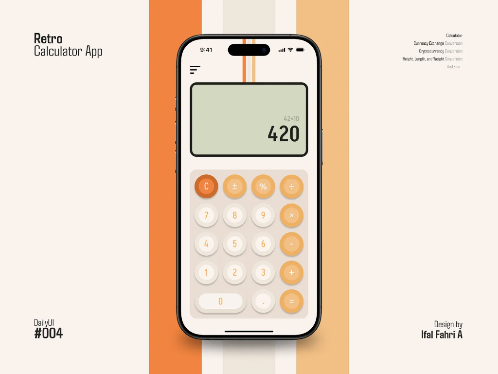
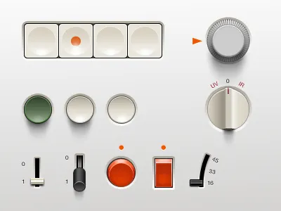

# DiRams Design System

Design system inspired by Dieter Rams' industrial design principles.




## Principles

1. **Semantic HTML elements first** - Use `<section>`, `<article>`, `<header>`, `<footer>`, `<mark>`, `<data>`, etc.
2. **Classes only where necessary** - Avoid utility "class soup"
3. **Contextual CSS** - Styles based on hierarchy and structure
4. **"Weniger, aber besser"** - Less, but better

## Color Palette (DiRams Authentic)

### Base (Earthy & Timeless)
- **Soft Linen** `#E6E2D8` - Light warm beige background
- **Alabaster Grey** `#E1E0DE` - Secondary elements, borders
- **Off-White** `#fafaf8` - Warm white surface for cards
- **Gunmetal** `#414141` - Main text, metallic gray

### Braun Accents
- **Toasted Almond** `#E88745` - Earthy orange (primary)
  - Hover: `#d67435` - Darker
- **Dusty Olive** `#6A7E64` - Military olive green (success)
  - Light: `#89a584` - Lighter
- **Error Red** `#d9534f` - Earthy red
- **Warning Amber** `#e8a75e` - Soft amber

### Grays (full scale)
```css
--color-gunmetal: #414141     /* Text */
--color-soft-linen: #E6E2D8   /* Background */
--color-alabaster: #E1E0DE    /* Borders */
--color-gray-700: #5a5a5a
--color-gray-600: #787878
--color-gray-500: #9a9a9a
--color-gray-400: #b8b8b8
--color-gray-300: #d4d4d4
--color-white: #fafaf8        /* Off-white */
```

## Shadows (warm and subtle)

```css
--shadow-inset: inset 0 1px 3px rgba(65, 65, 65, 0.08)
--shadow-sm: 0 1px 2px rgba(65, 65, 65, 0.06)
--shadow-base: 0 1px 3px rgba(65, 65, 65, 0.10), 0 2px 6px rgba(65, 65, 65, 0.06)
--shadow-md: 0 2px 8px rgba(65, 65, 65, 0.10), 0 4px 12px rgba(65, 65, 65, 0.06)
--shadow-lg: 0 4px 16px rgba(65, 65, 65, 0.10), 0 8px 24px rgba(65, 65, 65, 0.06)
```
*Shadows tinted with gunmetal to harmonize with the earthy palette.*

## Border Radius

```css
--border-radius-sm: 3px      /* Inputs and buttons */
--border-radius-base: 6px    /* Default - cards */
--border-radius-lg: 12px     /* Large cards (not currently used) */
--border-radius-full: 9999px /* Circular badges */
```

## File Structure

```
app/assets/stylesheets/
├── application.css          # Entry point (imports only)
├── dirams/
│   ├── variables.css       # Design tokens (139 lines)
│   ├── reset.css           # Semantic base (212 lines)
│   ├── layout.css          # Navigation and structure (54 lines)
│   ├── components.css      # Buttons, forms, tables (106 lines)
│   └── utilities.css       # .sr-only only (17 lines)
└── pages/
    └── transactions.css    # Page-specific styles (407 lines)
```

**Total: 935 lines of CSS**

## Usage Example

### ✅ Correct (Semantic)
```html
<section class="summary">
  <article class="metric income">
    <label>Receitas</label>
    <data value="1500">R$ 1.500,00</data>
  </article>
</section>
```

### ❌ Avoid (Class Soup)
```html
<div class="grid grid-4 gap-4 mb-6">
  <div class="card bg-white p-5 rounded-lg shadow-base">
    <label class="text-xs text-muted uppercase">Receitas</label>
    <p class="text-xl font-bold text-success">R$ 1.500,00</p>
  </div>
</div>
```

## Components

### Buttons

**Primary (Toasted Almond)**
- Background: `#E88745`
- Hover: `#d67435`
- Text: `#fafaf8` (off-white)
- Shadow: `var(--shadow-base)`

**Secondary (Off-White)**
- Background: `#fafaf8`
- Hover: `#E6E2D8` (soft linen)
- Text: `#414141` (gunmetal)
- Shadow: `var(--shadow-base)`

### Badges

**Circular, using the Braun palette (standardized semantic colors):**
- **Income/Receita**: `#6A7E64` (dusty olive) with background `rgba(106, 126, 100, 0.12)`
  - Used in: Categories, Account Types (role: income), Transaction amounts
- **Expense/Despesa**: `#d9534f` (error red) with background `rgba(217, 83, 79, 0.12)`
  - Used in: Categories, Account Types (role: expense), Transaction amounts
- **Transfer/Transferência**: `#c68a42` (darkened warning amber) with background `rgba(232, 167, 94, 0.12)`
  - Used in: Categories (transfer), Transaction cards
- **Asset/Ativo** (neutral): `#c68a42` (darkened warning amber) with background `rgba(232, 167, 94, 0.12)`
  - Used in: Account Types (role: asset), Account type badges

### Cards

- Background: `#fafaf8` (off-white)
- Border: none
- Border-radius: `6px`
- Shadow: `var(--shadow-base)`

## Visual References

### Braun Vintage Aesthetic
Earthy, timeless design inspired by Braun products from the 60s-80s:
- Warm, natural colors
- Earthy orange as the focal accent
- Signature military olive green
- Soft, elegant textures

### Authentic Palette
- **Toasted Almond**: Classic Braun orange
- **Soft Linen**: Warm beige background
- **Dusty Olive**: Iconic military green
- **Alabaster Grey**: Alabaster gray for secondary elements
- **Gunmetal**: Metallic gray for text
